# Instituição
ETEC Vasco Antonio Venchiarutti

# Curso
Desenvolvimento de Sistemas

# Turma
2°C1

# Autores
- Igor Daniel
- Igor Matheus

---

# 📱 Projeto

## Título
Israel Battle

---

## Descrição

**Objetivo do aplicativo:**
### Entender relações geopolíticas de guerras da perspectiva do governante e como decisões que acarretam em inúmeras mortes muitas vezes não passam de números em uma tela.

**Como o aplicativo funciona:**
### A aplicação funciona como um simulador narrativo baseado em escolhas. O utilizador assume a posição de ministro, tomando decisões em resposta a cenários de crise. A lógica do sistema ramifica a narrativa com base nas escolhas feitas (botões), conduzindo o utilizador através de diferentes fluxos de telas que culminam em múltiplos finais possíveis.

**Conceitos da apostila utilizados:**
### O sistema é baseado em um simples sistema de condicionais, onde quando um botão (escolha do jogador) é clicado, o player pula para outra tela, onde há mais decisões e assim por diante. Também foram usados os *Vertical* e *Horizontal Arragement* para garantir a centralização dos elementos na tela. O design foi pensado para ser simples de entender e ter uma arte homogênea por todo o app. 

**Recursos ou componentes utilizados:**
- Condicionais dentro de objetos (telas e botões)
- Recursos de organização vertical/horizontal
- Legenda
- Imagens
- Caixa de texto

**Melhorias ou ideias novas:**
- Sensor Acelerômetro para tomada de decisão
- Texto para Falar (ler o texto em voz alta)

---

## 🖥 Print das telas do Design

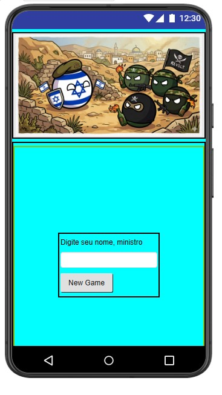
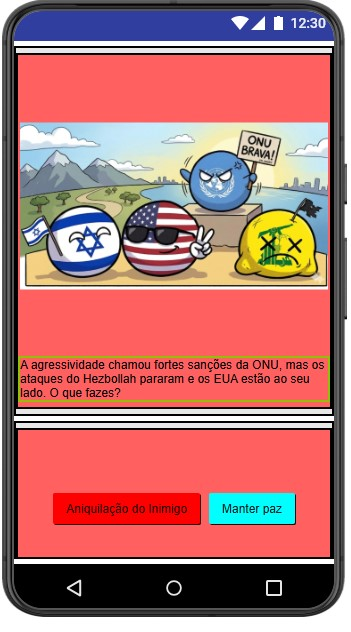
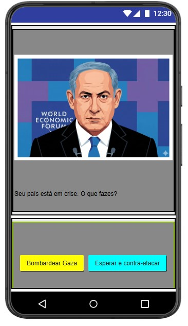
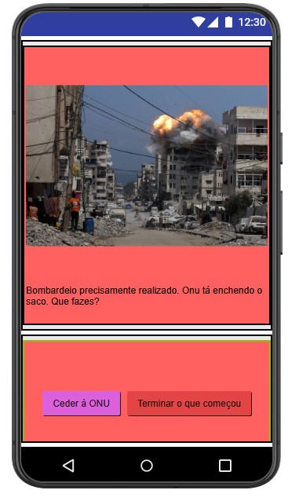
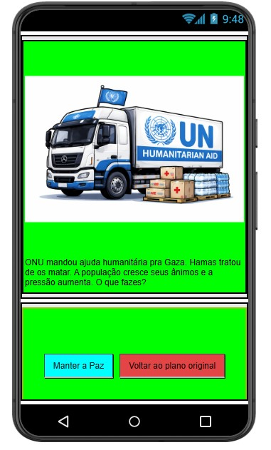
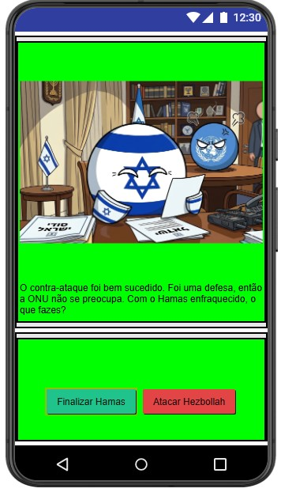
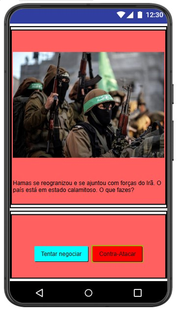
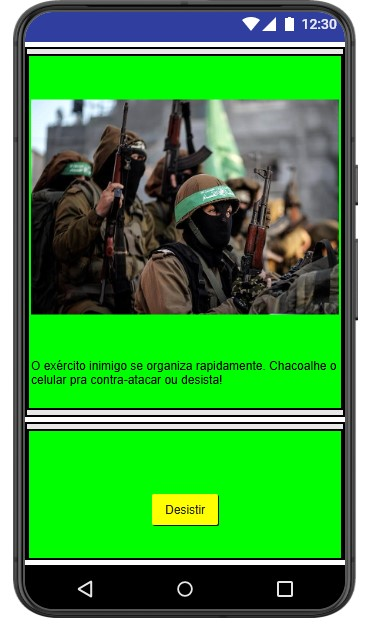
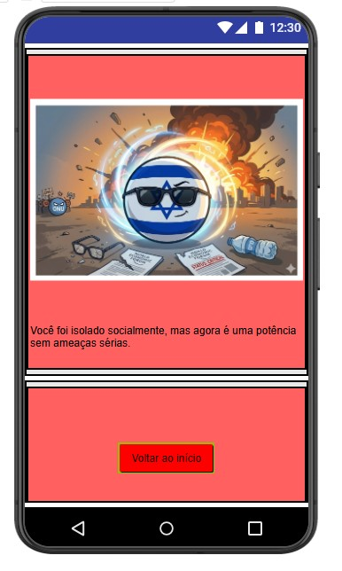
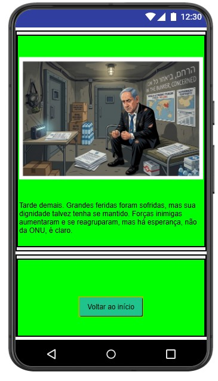
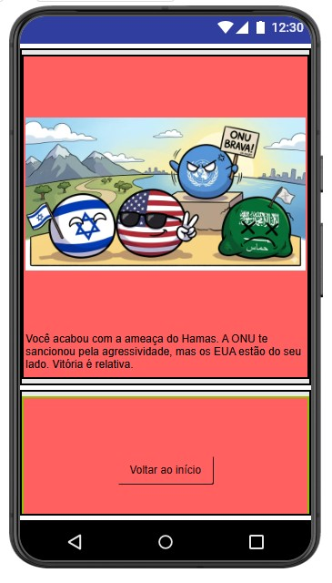
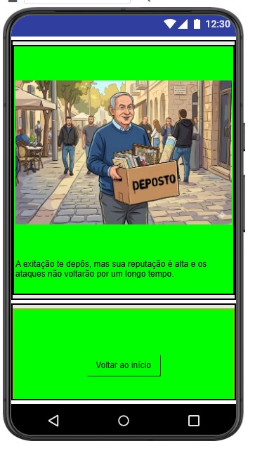
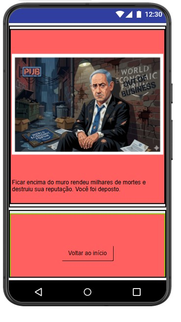

---

## 🧩 Print das telas dos Blocos

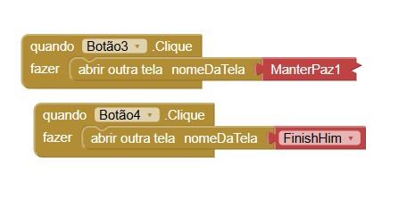
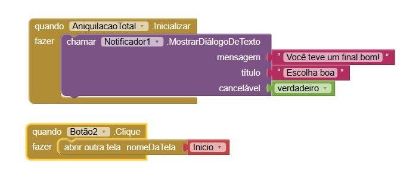
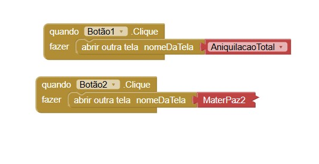
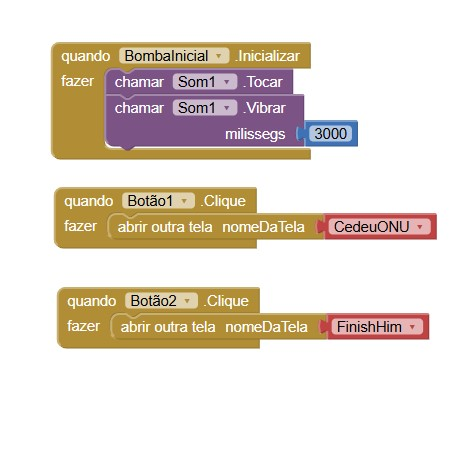
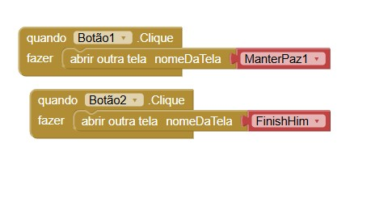
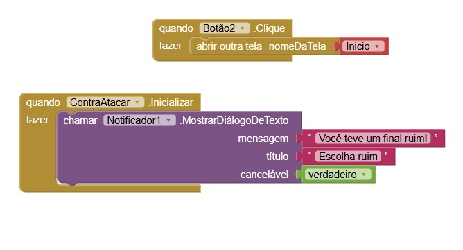
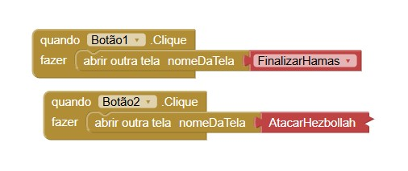
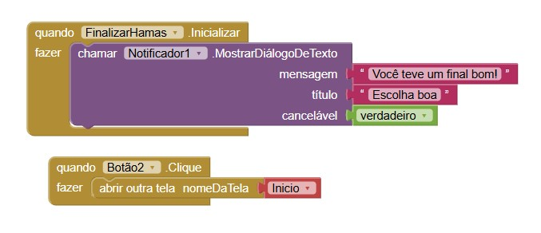
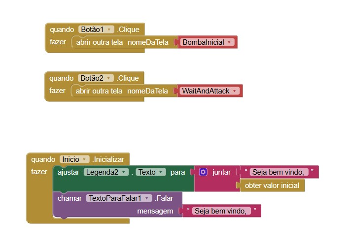
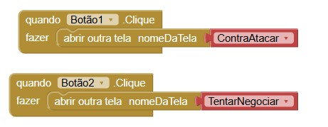
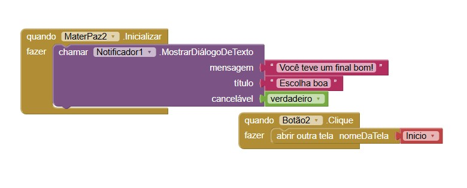
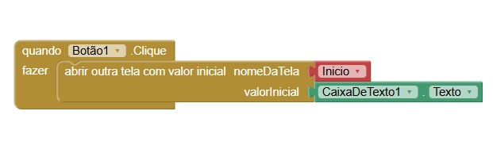
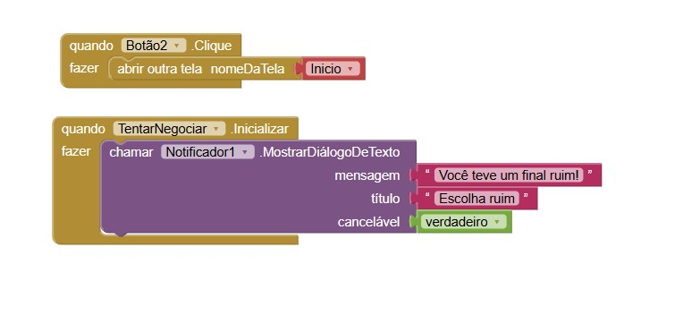
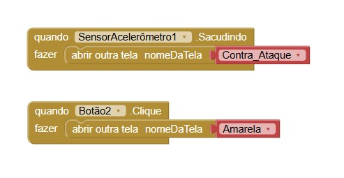
