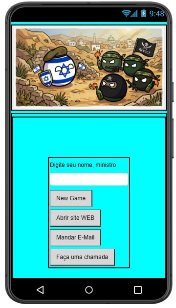
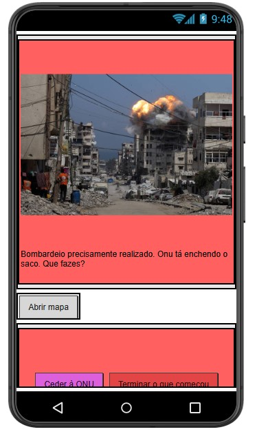
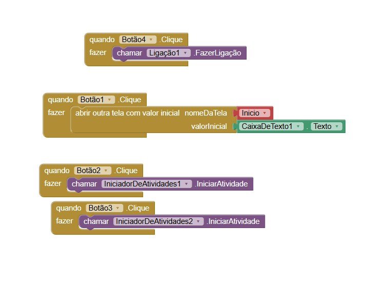
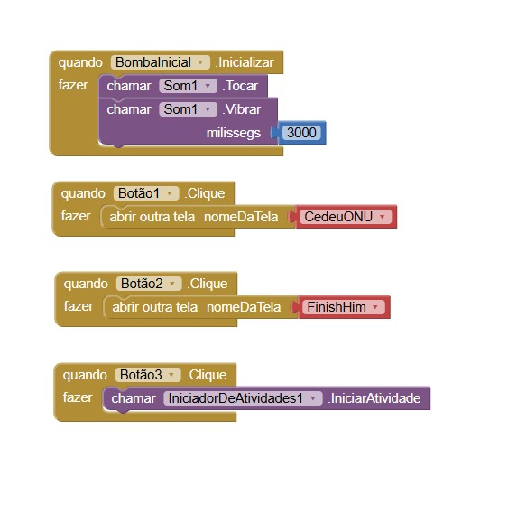

# Instituição
ETEC Vasco Antonio Venchiarutti

# Curso
Desenvolvimento de Sistemas

# Turma
2°C1

# Autores
- Igor Daniel
- Igor Matheus

---

## 🖥 Print das telas do Design com alterações

### Três novas funcionalidades adicionadas na tela inicial: website informativo "Monitor do Oriente Médio", email para a cantral de atendimento da ONU e sistema de chamada para o Comitê Internacional da Cruz Vermelha (CICV).

### Nova funcionalidade na tela de escolha 1: mapa interativo de Gaza.

---

## 🧩 Print das telas dos Blocos com alterações

### Bloco das três novas funcionalidades adicionadas na tela inicial: website (botão 2), email (botão 3) e sistema de chamada (botão 4).

### Bloco da nova funcionalidade na tela de escolha 1: mapa interativo de Gaza (botão 3).
