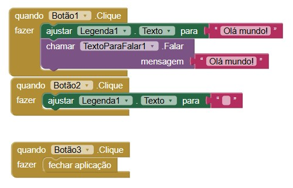
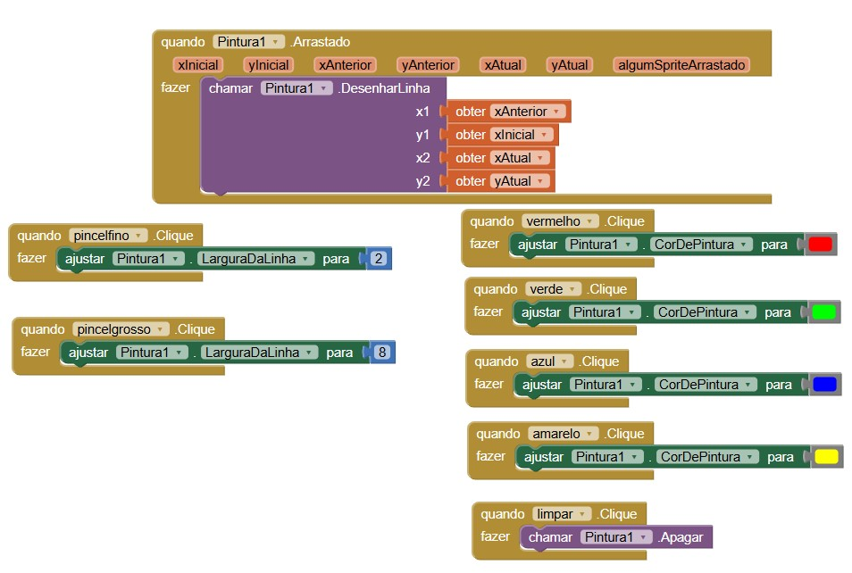
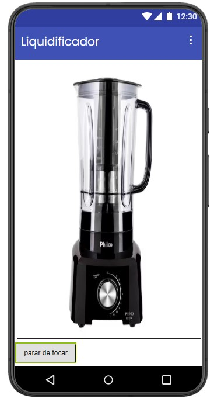

# Relatório – Desenvolvimento de Aplicativos (App Inventor)

## Centro Paula Souza
Etec Vasco Antonio Venchiarutti - Jundiaí SP

## Curso
Técnico em Desenvolvimento de Sistemas Integrado ao Ensino Médio

## Turma
2°C1

## Autores
Igor Daniel R. Eustachio e Igor Matheus de França Fernandes

---

# Projeto 1 – Primeiro Aplicativo 

### Descrição:
O objetivo é criar uma saudação inicial. Ao clicar no botão "Clique Aqui", o aplicativo exibe "Olá Mundo" em uma legenda

### Melhoria sugerida: 
Foi adicionado o componente de mídia TextoParaFalar para que, além de exibir o texto na tela, o celular "fale" a frase "Olá Mundo" em voz alta ao clicar no botão.

## Print do Design

## Print dos Blocos

---

# Projeto 2 – Segundo Aplicativo 

### Descrição:
O aplicativo permite desenhar sobre uma imagem de fundo (globo terrestre) utilizando diferentes cores ao arrastar o dedo na tela

### Melhoria sugerida: 
Foram adicionados dois novos botões: "Pincel Fino" e "Pincel Grosso". Na programação em blocos, foi utilizado o componente ajustar Pintura1.LarguraDaLinha 
para que o usuário possa alternar entre um traço mais delicado (valor 2) e um traço mais destacado (valor 8).

## Print do Design

## Print dos Blocos

---

# Projeto 3 – Terceiro Aplicativo 

### Descrição:
Ao tocar na imagem de um liquidificador, o celular deve vibrar e reproduzir o som do aparelho funcionando

### Melhoria sugerida: 
Inclusão de um botão para interromper o som (Stop)

## Print do Design

## Print dos Blocos

---

# Projeto 4 – Quarto Aplicativo 

### Descrição:
Utiliza o componente de hardware do celular para capturar fotografias. O app abre a câmera, tira a foto e a exibe em um componente de imagem na tela

### Melhoria sugerida: 
Inclusão de um botão para interromper o som (Stop)

## Print do Design

## Print dos Blocos

---